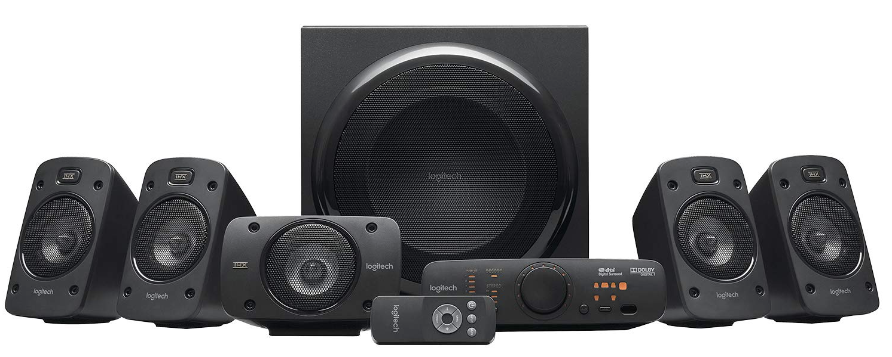
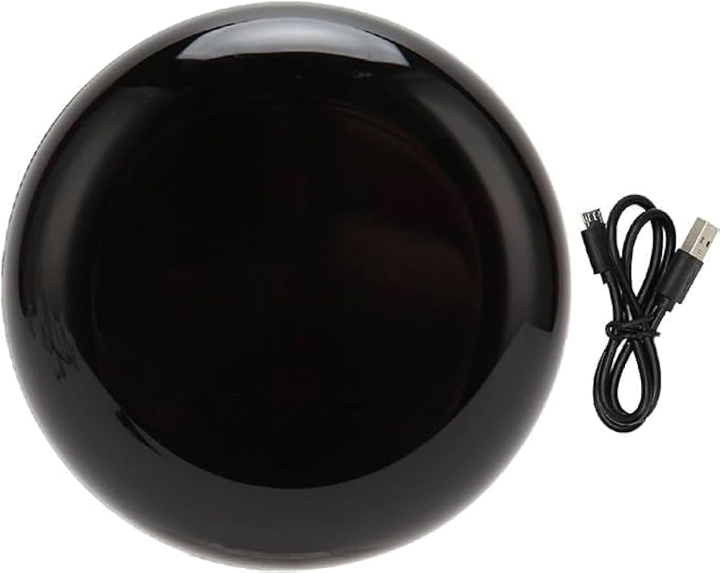

# Logitech Z906 InfraRed smart controller API

On my TV I'm using the Logitech Z906 sound system, but there is something I find annoying all the time. That
is that I need to use the Logitech controller to turn the audio on also to modify the volume.

It doesn't work with the TV volume controller.



# Solution

This project replicates the original Logitech controller signal to modify the volume and turn on
the audio from an HTTP API. And the TV controller buttons will send requests to this API.

With that, I don't need the original controller anymore!

# Replicating the infra-red signal

I did get an infra-red smart device that can send the same signal as the Logitech controller.



# Mapping TV controller buttons

I used a Play Store app called "Button Mapper: Remap your keys"

Check it out: https://play.google.com/store/apps/details?id=flar2.homebutton&hl=en

# Hosting this service

I used a raspberry PI that I have to control all my IoT devices, but you can host this anywhere, even on the internet.

# Controlling the smart infra-red device

This service is using tuya platform API. You will have to register an account there and link your smart life account to a project.

# Settings setup

To allow access to your tuya account you should modify `.env` file or modify OS environment variables to provide necessary information.

```properties
CLIENT_ID=xxxx
SECRET=xxxxxx
HOST=https://openapi.tuyaeu.com
IR_DEVICE_ID=xxxx
AUDIO_DEVICE_ID=xxxx
```

# Results demonstration


